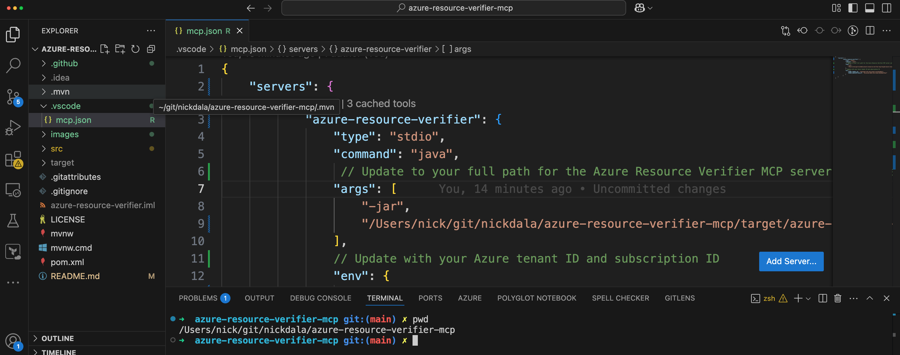
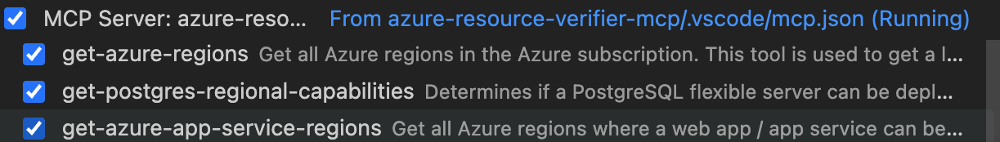
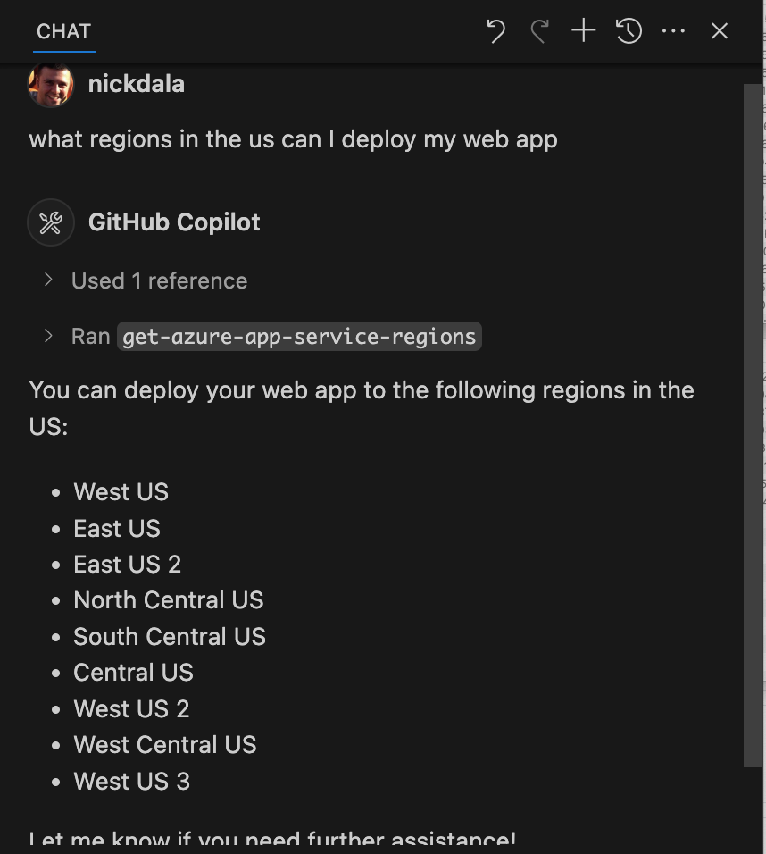

# Azure Resource Verifier MCP

<div align="center">
  
</div>

## What is this? 🤔

This is an AI assistant for verifying Azure resources across regions through the [Model Context Protocol](https://modelcontextprotocol.io/) (MCP). This tool helps determine which Azure services are available in different regions and with specific configurations. 

Note: This is an MCP implementation of the [azure-resource-verifier](https://github.com/nickdala/azure-resource-verifier).

## Overview

This MCP server provides a set of tools to verify the availability of Azure resources, such as:

- App Services (Web Apps)
- PostgreSQL Flexible Server
- Azure Regions

Using these tools, you can check which regions support your required Azure services and configurations before deployment.

### Quick Example

```text
You: "Show me the available regions for PostgreSQL flexible server"
Claude: "Sure! Here are the available regions for PostgreSQL flexible server:"
Claude: "East US, West US, North Europe"
```

## Prerequisites

- Java 17 or higher
- Maven
- JBang
- Azure CLI installed and authenticated
- Azure subscription
- Claude Desktop or VS Code

## Building the Project

To build the project:

```bash
./mvnw clean package
```

## Integrating with VS Code

Note: In order to use MCP servers with VS Code, you need to have the latest version of 1.99.1 or higher and enable chat agents in the settings. For more information, refer to [VS Code Documentation](https://code.visualstudio.com/updates/v1_99#_agent-mode-is-available-in-vs-code-stable)

### Start the MCP Server

Edit the `mcp.json` file in the `.vscode` directory of your workspace to include the full path to the JAR file as well as the required environment variables. The `mcp.json` file should look like this:

```json
{
    "servers": {
        "azure-resource-verifier": {
            "type": "stdio",
            "command": "java",
            "args": [
                "-jar",
                "/path/to/azure-resource-verifier-0.0.1-SNAPSHOT.jar"
            ],
            "env": {
                "AZURE_TENANT_ID": "your-tenant-id",
                "AZURE_SUBSCRIPTION_ID": "your-subscription-id"
            }
        }
    }
}
```



### Open Copilot Chat and verify the MCP server is running

1. Open up the Copilot chat panel in VS Code.
2. Make sure that agent mode is selected.
3. Click on the *Tools* icon in the chat panel.



### Chat with the MCP server in VS Code:



## Integrating with Claude Desktop

To use this MCP server with Claude, create or update the Claude configuration file:

```json
{
    "mcpServers": {
        "azure-resource-verifier": {
            "type": "stdio",
            "command": "java",
            "args": [
                "-jar",
                "/path/to/azure-resource-verifier-0.0.1-SNAPSHOT.jar"
            ],
            "env": {
                "AZURE_TENANT_ID": "your-tenant-id",
                "AZURE_SUBSCRIPTION_ID": "your-subscription-id"
            }
        }
    }
}
```

### macOS and Windows Configuration Paths

The configuration file location depends on your operating system:

- **macOS**: `~/Library/Application Support/Claude/claude_desktop_config.json`
- **Windows**: `%USERPROFILE%\AppData\Roaming\Claude\claude_desktop_config.json`


Make sure to replace `/path/to/azure-resource-verifier-0.0.1-SNAPSHOT.jar` with the actual path to the built JAR file.
You can find the JAR file in the `target` directory after building the project.

### Environment Variables

The following environment variables are required:

- `AZURE_TENANT_ID` - Your Azure tenant ID
- `AZURE_SUBSCRIPTION_ID` - Your Azure subscription ID

You can authenticate using the Azure CLI before running the server:

```bash
az login
```

If you have multiple tenants, you can use the following command to log into the tenant:

```bash
az login --tenant <tenant-id>
```

Use the following command to get the current tenant and subscription information:

```
az account show
```

## Available MCP Tools

### get-azure-regions

Get all Azure regions in your subscription.

```
get-azure-regions
```


### get-azure-app-service-regions

Get Azure regions where a specific app service configuration can be deployed.

```
get-azure-app-service-regions
```

Parameters:
- `os` - Either "windows" or "linux"
- `publishingType` - Either "code" or "container"


### get-postgres-capabilities

Get PostgreSQL flexible server capabilities in your Azure subscription.

```
get-postgres-capabilities
```

Parameters:
- `regions` - List of Azure regions to check


## License

This project is licensed under the MIT License - see the [LICENSE](LICENSE) file for details.
