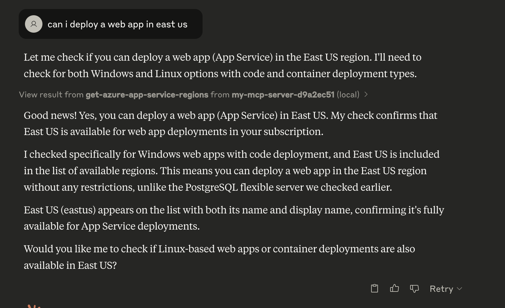

# Azure Resource Verifier MCP

An AI assistant for verifying Azure resources across regions through the [Model Context Protocol](https://www.modelcontextprotocol.ai/) (MCP). This tool helps determine which Azure services are available in different regions and with specific configurations.

## Overview

This MCP server provides a set of tools to verify the availability of Azure resources, such as:

- App Services (Web Apps)
- PostgreSQL Flexible Server
- Azure Regions

Using these tools, you can check which regions support your required Azure services and configurations before deployment.

## Prerequisites

- Java 17 or higher
- Maven
- Azure CLI installed and authenticated
- Azure subscription

## Building the Project

To build the project:

```bash
./mvnw clean package -DskipTests
```

## Integrating with Claude

To use this MCP server with Claude, create or update the Claude configuration file:

```json
{
    "mcpServers": {
        "azure-resource-verifier": {
            "type": "stdio",
            "command": "java",
            "args": [
                "-jar",
                "/path/to/azure-resource-verifier-0.0.1-SNAPSHOT.jar"
            ],
            "env": {
                "AZURE_TENANT_ID": "your-tenant-id",
                "AZURE_SUBSCRIPTION_ID": "your-subscription-id"
            }
        }
    }
}
```

### macOS and Windows Configuration Paths

The configuration file location depends on your operating system:

- **macOS**: `~/Library/Application Support/Claude/claude_desktop_config.json`
- **Windows**: `%USERPROFILE%\AppData\Roaming\Claude\claude_desktop_config.json`


Make sure to replace `/path/to/azure-resource-verifier-0.0.1-SNAPSHOT.jar` with the actual path to the built JAR file.
You can find the JAR file in the `target` directory after building the project.

### Environment Variables

The following environment variables are required:

- `AZURE_TENANT_ID` - Your Azure tenant ID
- `AZURE_SUBSCRIPTION_ID` - Your Azure subscription ID

You can authenticate using the Azure CLI before running the server:

```bash
az login
```

Use the following command to get the current tenant and subscription information:

```
az account show
```

## Available MCP Tools

### get-azure-regions

Get all Azure regions in your subscription.

```
get-azure-regions
```


### get-azure-app-service-regions

Get Azure regions where a specific app service configuration can be deployed.

```
get-azure-app-service-regions
```

Parameters:
- `os` - Either "windows" or "linux"
- `publishingType` - Either "code" or "container"




### get-postgres-capabilities

Get PostgreSQL flexible server capabilities in your Azure subscription.

```
get-postgres-capabilities
```

Parameters:
- `regions` - List of Azure regions to check


## License

This project is licensed under the MIT License - see the [LICENSE](LICENSE) file for details.
